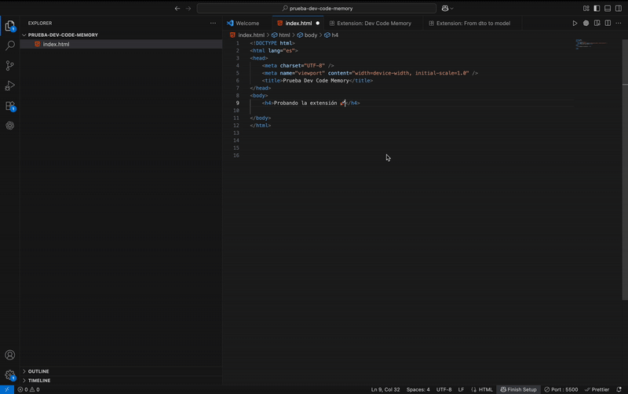

# Dev Code Memory

ES · Guarda, organiza e inserta fragmentos de código en múltiples lenguajes.
EN · Save, organize, and insert code snippets in multiple languages.

Build: Enterprise Refactor — v4 (Bulletproof)

## Author

**Sebastian Piñeiro Madero**  
[Portfolio](https://sebastian-codes.vercel.app/) • [GitHub](https://github.com/SebastianPineiro10)

## Cheat Sheet (Acción → Teclado / Paleta)

Acción (ES / EN)	Win/Linux	macOS	Paleta / Command Palette
Guardar fragmento / Save snippet	Ctrl+Alt+D	Cmd+Alt+D	Dev Code Memory: Save Snippet
Insertar fragmento / Insert snippet	Ctrl+Alt+P	Cmd+Alt+P	Dev Code Memory: Insert Snippet
Eliminar fragmento / Delete snippet	Ctrl+Alt+K	Cmd+Alt+Backspace	Dev Code Memory: Delete Snippet
Resaltar coincidencias / Highlight matches	Ctrl+Alt+H	Cmd+Alt+H	Dev Code Memory: Highlight Matches
Reemplazar coincidencias / Replace matches	Ctrl+Alt+R	Cmd+Alt+R	Dev Code Memory: Replace Matches
Seleccionar bloque/etiqueta / Select block/tag	Ctrl+Alt+B	Cmd+Alt+B	Dev Code Memory: Select Block/Tag
Ir a la pareja / Goto matching	Ctrl+Alt+M	Cmd+Alt+M	Dev Code Memory: Goto Matching
Exportar colección (JSON) / Export collection (JSON)	Ctrl+Alt+E	Cmd+Alt+E	Dev Code Memory: Export Collection (JSON)
Importar colección (JSON) / Import collection (JSON)	Ctrl+Alt+I	Cmd+Alt+I	Dev Code Memory: Import Collection (JSON)

Abre la Paleta con Ctrl+Shift+P (Win/Linux) o Cmd+Shift+P (macOS).

## Tabla de Contenido / Table of Contents
	•	Autor / Author
	•	Overview / Descripción
	•	Características / Features
	•	Instalación / Installation
	•	Uso / Usage
	•	Importar / Exportar (Teclado & Paleta)
	•	Comandos (IDs y títulos)
	•	Atajos de Teclado / Keyboard Shortcuts
	•	Ejemplo de Snippet / Example
	•	Forma del JSON exportado / Exported JSON shape
	•	Requisitos / Requirements
	•	Privacidad y Datos / Privacy & Data
	•	Problemas Conocidos / Known Issues
	•	Hoja de Ruta / Roadmap
	•	Notas de Versión / Release Notes
	•	Licencia / License

## Autor / Author

Sebastian Piñeiro Madero
GitHub

## Overview / Descripción

EN
Dev Code Memory is a VS Code extension to save, organize, and quickly insert code snippets. It keeps your snippets in a Mongo-like JSON collection with fields (id, name, category, language, content, createdAt). The extension also includes 4 highlight modes, robust replace (text or HTML tag names), block/tag selection, goto matching, and a Delete Snippet command with confirmation.

ES
Dev Code Memory es una extensión de VS Code para guardar, organizar e insertar fragmentos de código. Conserva tus fragmentos en una colección JSON estilo Mongo con campos (id, name, category, language, content, createdAt). Además, incluye 4 modos de resaltado, reemplazo robusto (texto o nombres de etiquetas HTML), selección de bloques/etiquetas, salto a la pareja y comando para Eliminar fragmento con confirmación.

## Características / Features

ES
	•	E/S local robusta: snippets.json con bloqueo de concurrencia (mutex) y respaldo .tmp.
	•	Almacenamiento seguro: ahora se guarda en la carpeta de almacenamiento global de VS Code (globalStorage), evitando problemas de permisos.
	•	Guardado inteligente: sugiere nombre por contenido (primer tag HTML o function foo()).
	•	Detección de lenguaje: si el doc es plaintext, solicita languageId.
	•	Protección de sobrescritura: confirma si ya existe (name + language).
	•	Inserción filtrada por lenguaje: muestra primero los del lenguaje actual.
	•	Exportar/Importar (JSON): exporta arreglo de documentos; importa normalizando y fusionando por id (o language::name).
	•	Resaltado (4 modos): exacto/entero, parcial, palabra completa insensible, exacto insensible.
	•	Reemplazo robusto: por texto (palabra completa / case-insensitive) o por etiqueta HTML/XML (apertura/cierre).
	•	Bloques & etiquetas: Select Block y Goto Matching para {}, [], (), y <tag>…</tag>.
	•	Eliminar fragmento: nuevo comando con confirmación explícita.

EN
	•	Robust local I/O: snippets.json with concurrency lock and .tmp fallback.
	•	Safe storage: now uses VS Code global storage (globalStorage) to avoid permission issues.
	•	Smart save (auto name suggestion from content).
	•	Language detection (prompts languageId if plaintext).
	•	Overwrite protection for (name + language).
	•	Language-aware insertion (current language first).
	•	Export/Import (JSON) with normalization and merge by id (fallback language::name).
	•	Highlight (4 modes), robust replace (text or HTML tag), Select Block, Goto Matching.
	•	Delete snippet command with confirmation.

## Instalación / Installation

Desde Marketplace / From Marketplace
	1.	Abre Visual Studio Code → Extensiones (Ctrl+Shift+X).
	2.	Busca Dev Code Memory.
	3.	Instala y recarga VS Code.

Desde VSIX (local) / From VSIX
	1.	npx vsce package → genera dev-code-memory-<version>.vsix.
	2.	VS Code → “Install from VSIX…” y selecciona el archivo.

## Uso / Usage

ES
	•	Guardar fragmento: selecciona código → Ctrl+Alt+D (Cmd+Alt+D) → nómbralo → elige categoría.
	•	Insertar fragmento: Ctrl+Alt+P / Cmd+Alt+P → lista filtrada por lenguaje actual (o todos).
	•	Eliminar fragmento: Ctrl+Alt+K / Cmd+Alt+Backspace → selecciona y confirma.
	•	Resaltar coincidencias (4 modos): selecciona texto → Highlight Matches → elige modo.
	•	Reemplazar coincidencias: selecciona texto o nombre de etiqueta → Replace Matches → Todo o Uno por uno.
	•	Seleccionar bloque/etiqueta: cursor en {}, [], (), o <tag>…</tag> → Select Block.
	•	Ir a la pareja: cursor sobre/antes de bracket o etiqueta → Goto Matching.

EN
	•	Save snippet: select code → Ctrl+Alt+D (Cmd+Alt+D) → name it → choose category.
	•	Insert snippet: Ctrl+Alt+P / Cmd+Alt+P → list filtered by current language (or all).
	•	Delete snippet: Ctrl+Alt+K / Cmd+Alt+Backspace → pick snippet and confirm.
	•	Highlight matches (4 modes), Replace matches, Select Block, Goto Matching as above.

## Importar / Exportar (Teclado & Paleta) · Import / Export (Keyboard & Palette)

Paleta / Palette
	•	Export (JSON): Ctrl+Shift+P → “Export Collection (JSON)” → elige destino .json.
	•	Import (JSON): Ctrl+Shift+P → “Import Collection (JSON)” → elige archivo .json.

Atajos / Shortcuts (sugeridos / suggested)
	•	Exportar / Export: Ctrl+Alt+E (Win/Linux) · Cmd+Alt+E (macOS)
	•	Importar / Import: Ctrl+Alt+I (Win/Linux) · Cmd+Alt+I (macOS)

El archivo exportado es un arreglo de documentos { id, name, category, language, content, createdAt }.
En importación se normaliza y se fusiona por id (o language::name si falta id).

## Comandos (IDs y títulos) / Commands

ID	Título (EN)	Título (ES)
dev-code-memory.addSnippet	Dev Code Memory: Save Snippet	Dev Code Memory: Guardar Fragmento
dev-code-memory.insertSnippet	Dev Code Memory: Insert Snippet	Dev Code Memory: Insertar Fragmento
dev-code-memory.deleteSnippet	Dev Code Memory: Delete Snippet	Dev Code Memory: Eliminar Fragmento
dev-code-memory.exportSnippets	Dev Code Memory: Export Collection (JSON)	Dev Code Memory: Exportar Colección (JSON)
dev-code-memory.importSnippets	Dev Code Memory: Import Collection (JSON)	Dev Code Memory: Importar Colección (JSON)
dev-code-memory.highlightMatches	Dev Code Memory: Highlight Matches	Dev Code Memory: Resaltar Coincidencias
dev-code-memory.replaceMatches	Dev Code Memory: Replace Matches	Dev Code Memory: Reemplazar Coincidencias
dev-code-memory.selectBlock	Dev Code Memory: Select Block/Tag	Dev Code Memory: Seleccionar Bloque/Etiqueta
dev-code-memory.gotoMatching	Dev Code Memory: Goto Matching	Dev Code Memory: Ir a la Pareja

## Atajos de Teclado / Keyboard Shortcuts
	•	Guardar / Save: Ctrl+Alt+D · Cmd+Alt+D
	•	Insertar / Insert: Ctrl+Alt+P · Cmd+Alt+P
	•	Eliminar / Delete: Ctrl+Alt+K · Cmd+Alt+Backspace
	•	Resaltar / Highlight: Ctrl+Alt+H · Cmd+Alt+H
	•	Reemplazar / Replace: Ctrl+Alt+R · Cmd+Alt+R
	•	Select Block/Tag: Ctrl+Alt+B · Cmd+Alt+B
	•	Goto Matching: Ctrl+Alt+M · Cmd+Alt+M
	•	Export: Ctrl+Alt+E · Cmd+Alt+E
	•	Import: Ctrl+Alt+I · Cmd+Alt+I

Si algún atajo entra en conflicto, cámbialo en Preferences → Keyboard Shortcuts.

## Ejemplo de Snippet / Example

{
  "id": "a1b2c3d4",
  "name": "HelloWorldJS",
  "category": "JavaScript",
  "language": "javascript",
  "content": "console.log('Hello, world!');",
  "createdAt": "2025-09-15T12:34:56.789Z"
}

Forma del JSON exportado / Exported JSON shape

[
  {
    "id": "a1b2c3d4",
    "name": "HelloWorldJS",
    "category": "JavaScript",
    "language": "javascript",
    "content": "console.log('Hello, world!');",
    "createdAt": "2025-09-15T12:34:56.789Z"
  }
]

## Requisitos / Requirements

VS Code 1.103.0 o superior / or higher.

## Privacidad y Datos / Privacy & Data

ES
Los fragmentos se guardan localmente en snippets.json dentro de la carpeta de almacenamiento global de VS Code (scope del usuario). La extensión no envía tus datos a servidores externos.

EN
Snippets are stored locally in snippets.json under VS Code global storage (user scope). The extension does not send your data to external servers.

## Problemas Conocidos / Known Issues

ES
	•	Sincronización en la nube: no disponible todavía.
	•	Importación: JSON inválido o esquema inesperado se rechaza; duplicados se fusionan por id (o language::name).
	•	Concurrencia: se usa .tmp como respaldo de escritura segura.

EN
	•	Cloud sync: not available yet.
	•	Import: invalid JSON/unexpected schema is rejected; duplicates merge by id (or language::name).
	•	Concurrency: .tmp safe-write fallback.

## Hoja de Ruta / Roadmap

v5 (planeado / planned)
	•	Sincronización en la nube / Cloud sync
	•	Colecciones compartidas por equipo / Team sharing
	•	Búsqueda avanzada por etiquetas / Advanced tag search & multi-channel navigation

## Notas de Versión / Release Notes

0.0.1
	•	EN Initial release: save, organize, and insert snippets.
	•	ES Versión inicial: guardar, organizar e insertar fragmentos.

0.0.4 — Enterprise Refactor (Bulletproof)
	•	NEW: Delete Snippet con confirmación modal.
	•	NEW: Almacenamiento en VS Code globalStorage para evitar permisos.
	•	NEW: Salida de build a dist/extension.js (Webpack).
	•	Highlight (4 modos), replace robusto (tags + texto), navegación de bloques/etiquetas.
	•	E/S con lock + fallback .tmp.

## Licencia / License

ES
PROPIETARIA — TODOS LOS DERECHOS RESERVADOS. Esta extensión y su código fuente son propiedad intelectual de Sebastian Piñeiro Madero (SerenoDevs). Prohibida la copia, modificación, redistribución o uso comercial sin permiso previo por escrito.

EN
PROPRIETARY — ALL RIGHTS RESERVED. This extension and its source code are the intellectual property of Sebastian Piñeiro Madero (SerenoDevs). Unauthorized copying, modification, redistribution, or commercial use is strictly prohibited without prior written permission.

